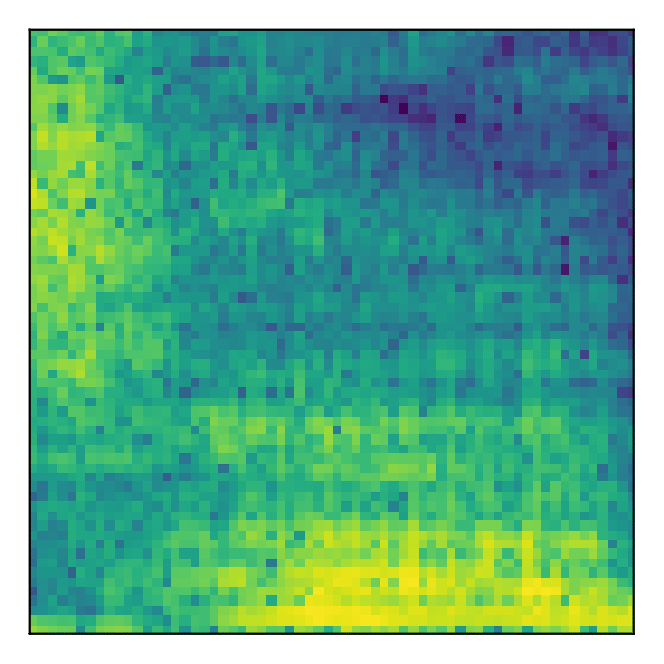

# A Generative approach to Audio Inpainting

This project tackled the task of audio inpainting (reconstructing missing samples) for speech data. We evaluated how good deep learning approaches were at reconstructing missing audio segments in the frequency domain. In particular, two architectures were tested: U-Net (an encoder-decoder architecture) and Pix2Pix (a c-GAN, conditional Generative Adversarial Network). These methods were compared to more traditional approaches, such as Linear Predictive Coding, and shown to not only provide competitive results but also to generate sharper reconstructions that closely approximate the missing target. Finally, we also investigated the effect of varying the amount of missing audio data and size of the available context on the quality of the reconstruction.

*For a more detailed description of the work done, you can read our report [HERE](./generative_audio_inpainting_report.pdf).*

# Results
Examples from the reconstructions obtained can be seen below:

Target | Source | c-GAN | U-Net | LPC | Interp
:--------:|:---:|:-----:|:-----:|:---:|:-------------:
 |  |  |  |  | 
 |  |  |  |  | 

# Data Processing

1. First the original audio data is transformed to the frequency domain using the Short Time Fourier Transform (STFT).
2. The resulting complex-valued data is transformed into its polar coordinates and the phase information is discarded.
3. Finally, random patches across the frequency data are extracted, and training pairs are created, consisting of the original patch (target image), and the original patch with a middle stroke set to zero (source image). See below for an example.

4. The objective is then to fill in the missing magnitude data of the source image such that the inpainting is natural and blends seamlessly into the surrounding context.

# Libraries

- `mlp`: includes the necessary tools to preprocess the audio files and generate the training datasets.
- `models`: includes the architectures tested throughout the project.
- `rml`: includes personalised training (loops, annealing, metrics, etc) and prediction utils.

# Notebooks

In the Jupyter Notebooks (in the folder `notebooks`) the experiments performed during the project can be seen. They include:

- Data Exploration: an analysis of the data and its distribution.
- A Basic Sound Processing
- Bilinear Interpolation: the first method tested to fill in the missing data used is a simple interpolation.
- Linear Predictive Coding: a more advanced but still algorithmic method to fill in the missing audio segments.
- U-Net Training: an encoder-decoder architecture trained to fill in the missing audio segments.
- Gap vs Context experiments: How the size of the context and of the gap to be filled affect the results obtained by the U-Net.
- Pix2Pix Training: A cGAN approach (Pix2Pix) is tested on the task.
- Plotting Pix2Pix Losses: An analyses of the training curves for the Pix2Pix training.

# Installation guide

To run the notebooks and/or libraries in this repository, it is necessary to install some dependencies. The file conda_environment.yml lists these dependencies and can be directly used to create a Conda environment with them installed (see [HERE](https://docs.conda.io/projects/conda/en/latest/user-guide/install/index.html)
for a tutorial on how to install Conda). Once Conda is available, run:
```
conda env create -f conda_environment.yml
conda activate generative-audio-inpainting
pip install ./libraries
```

These commands will first create an environment named "generative-audio-inpainting", then activate it and install in it the libraries in the repository ("mlp", "rml" and "models"). Once this is done, the environment should be ready to run the notebooks. In case you want to install the libraries in developer mode substitute the last line by pip install -e ./libraries

To remove the environment and all its installed libraries execute:
```
conda deactivate
conda remove -y --name generative-audio-inpainting --all
```

